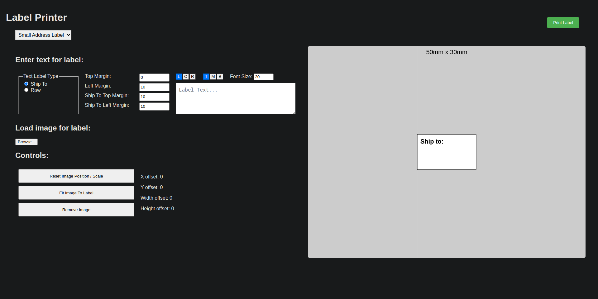

# Introduction
This repo contains the code for the L+H2 / Jaden label web based print portal. The purpose of this is to ensure a streamlined printing process for labels from any computer on any OS. Attempts were made to configure universality through CUPS but these did not work well. OSes were unable to retrieve the ppd file from CUPS and as a result they added their own default configuration options to any print. This resulted in additional padding and text that was way too small. It would be nice if these dialogs decided the raw format was an acceptable option.

The portal is running on my olimex, which is the device I decided to hook up my two label printers to. I reverse engineered the L+H2 Mac CUPS filter to allow for Linux support and then setup CUPS on the olimex. I also cross compiled using Docker. You can find the filter repo here: [https://github.com/BigDru/lplush_linux_filter](https://github.com/BigDru/lplush_linux_filter)

Either way, direct printing that didn't use a raw queue such as `lp` failed. To combat this I decided to write up a web based print portal that will print images and custom text for shipping purposes. Interface looks like this:

# Components
Three folders:
 - html
 - node
 - systemd

## HTML
This folder contains the html, css, and javascript for the portal. These are run off of nginx. The site configuration is the default configuration (as far as I remember). I've included it in this repo as `default`.

In the future it would be nice to add the following:
 - Draw and drop for the image
 - Ctrl + V support if using some sort of snipping tool

## Node
The node folder is the supporting node application that saves the edited image from the HTML when the `Print Label` button is pressed. It simply waits for an image on port 3000 and then saves it to disk at `/var/www/html/printbox/`.

## Systemd
This folder contains the last piece of the puzzle. A script that monitors `/var/www/html/printbox/` for new files and prints anything it finds in that directory. It's supported by two systemd services which are enabled in the production environment.
